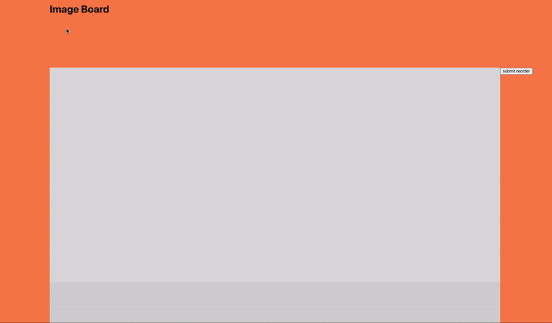

# Image Board

Image Board is a visual tool for image layout but may also act as a digital portfolio, or an extension for pre-existing portfolios. 
Prior to Image Board the project was called Memphis. Rather than continue to work on the original, I chose to take what I learned an rebuild the project piece by piece, while keeping a reference to all of the original code as I rebuild. 
For a more in depth look at what's to come, please refer to verion 1 [frontend](https://github.com/coreyleec/memphis) and [backend](https://github.com/coreyleec/memphis_backend).

UPDATE 08.16.21

Just a brief update as I get closer to refining the backend. I decided to continue with react bootstrap modal after trying to code it myself led to some issues with indexing (i.e., images tiles were appearing above the modal). I chose to shelve that issue since I had more success Bootstrap Modal.

To switch between photos within the modal, I originally relied upon each object assigned index value, but since I would allow the user to interact with two versions of the array, in edit mode and non-edit mode, I chose to set the value of the array conditionally based on whether the edit condition was met. In edit mode, img tags without photos appear as forms for which the user can link an image. When user is not in edit mode, the next and previous buttons will skip to the next img take with a src value. 

Additionally, I gave img tags with null img src's an additional CSS state, setting them to the back using their Z Index, and I also disabled the DnD feature, when the edit condition was not met. 

And lastly, I got rid of the "Reorder Submit" button, and set the edit switch to call the function when it's initial state was true and set to false. 

I'm still debating on the size of the image tiles, and thier on hover functionality. I am curious to try to set landscape photo heights to be half as tall and portrait photos to make the grid function a little better. I'm having an issue swith my JSON server saving the reordered array exacly as it is, but I won't worry about that unless the problems continues once I've reincorperated Rails/PostreSQL. 

Centering the modal image has been a bit tricky due to some of Bootsrap Modals default style settings being set to display block, but I plan to nest a container with an absolute position in center, and then styling within that. For more details, and code examples please see my [blog](https://medium.com/@CoreyLee) where I document my process. 

Changes in this iteration:

    - improve 2 dimensioanl Drag and Drop movement
    - save reordered photo array to the backend
    - incorperate masonry effect within the DnD grid

And upcoming changes include: 

    Photo series adjacent 
        - incorperate a blog feature that associates with each photo Folder or can be stand alone
        - add user and tag search
        - add user messaging
        - add public feed
    Aesthetics and functionality
        - clean up sidebar navigation
        - incorperate "settings" in right panel
        X left and right panel scrolls with window
        X edit toggle turns off DnD functionality
        - refine css transitions
in progress - drag and drop transfer from grid photo to folder in sidebar 
    Code
in progress - clean up my code
in progress - break app into smaller more specific componenents
    Misc
        - Present other code related projects as I build out the portfolio aspect

I'll include a more in depth walkthrough on my blog, as well as a link once the app is deployed.

For a more detailed explanation check this .

## References

This example was compiled adapting solutions from different sources.

After following several DnD grid examples, I found [blog post](https://thisisvini.com/responsive-mosaic-with-dnd-reactjs) by [viniciusgerevini](https://github.com/viniciusgerevini/react-responsive-mosaic) who had the cleanest implementation I've seen thus far. 

I'll also include his references, because it took all three from me to understand how everything worked. 

For the responsive masonry grid there's this [blog post](https://medium.com/@andybarefoot/a-masonry-style-layout-using-css-grid-8c663d355ebb).

And this react-dnd sortable [example](https://react-dnd.github.io/react-dnd/examples/sortable/simple) 

## Sidenotes

Although, this is above my skill level at the time of writitng this, it took so much reading to really grasp and utilize these examples, and I hope that what I've done with it and the documentation I'll eventually post will be of some help others that come to similar roadblocks in the future. 

