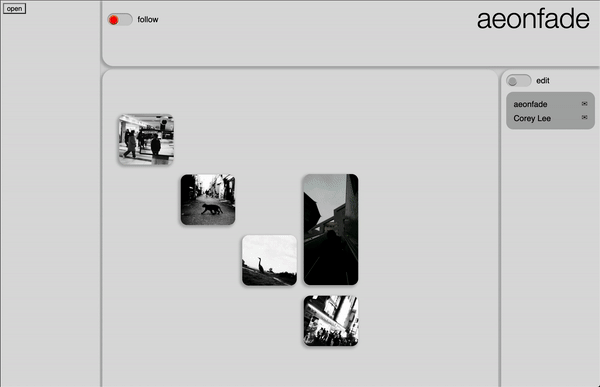
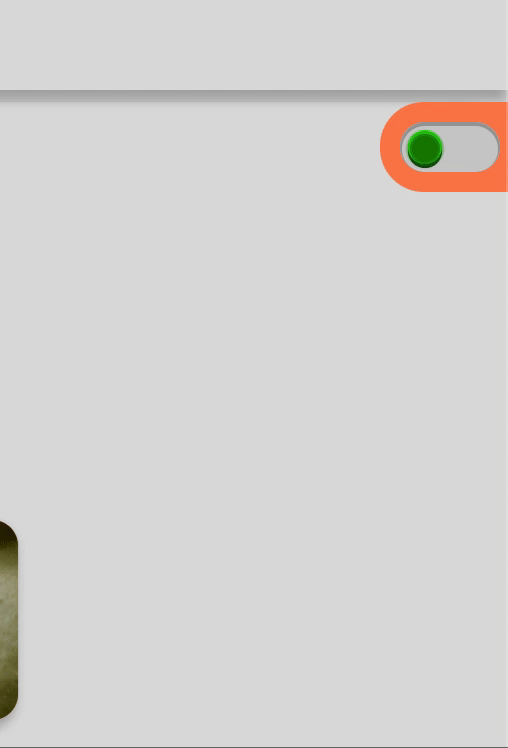
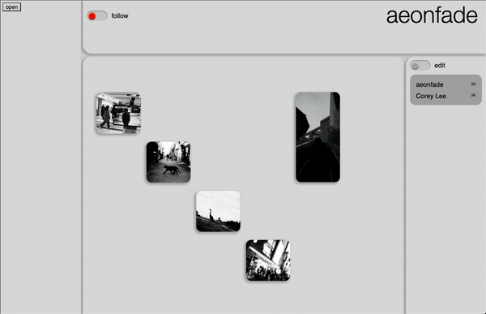

# Image Board

ImageBoard is a visual tool for curating photos, collaboration and presenting bodies of work in digital form

The idea for ImageBoard was born from a need to simplify editorial projects or gallery curation, where a person needs to be able to see multiple images at once, quickly reorder them, add text, and do this collaboratively if needed. Profiles also double as portfolios as they are a digital representation of a users bodies of work. 

This project has been creative outlet for me to learn while exploring my curiosities for coding, as well as a place to showcase my technical abilities and creativity. My main objective for this project was to learn through creating unique and complex elements. The following are a few examples of these.

|||
| --- | --- |
|  |  |
|  | | | 
 
 

Things to come:
- continue cleaning up code, storing repetitious code in variables, further consolidate repititous code for easier debugging. the project has been a lot of experimenting for the sake of learning, so I would like to go back and apply a best practices approach
- make the "guided" tutorial more guided
- optimize css transitions by reducing computations
- further debugging and resolving conflicting code
- an accompanying camera app for mobile
- adding the ability to reorder elements in the sidebar such as folders, and links
- adding an image bank to the right so a user can drag and store multiple images into the app before setting them in their desired place
- the ability to drag images from a file manager into a square on the grid
- because their are so many filters in the community page, I would like to revise the layout to utilize the left sidebar where information is already store
- add realtime updates for collaborators and profile visitors
- public and private toggle for folders
- including collaborative folders in collaborators sidebar
- adding a blog to accompanying folder
- adding a "like" value to photos for search filters and a separate button for adding to favorites
- lastly I would like to update code based on what's currently available from Rails and React, and eventually rewrite the backend in Python and the frontend using Typescript

